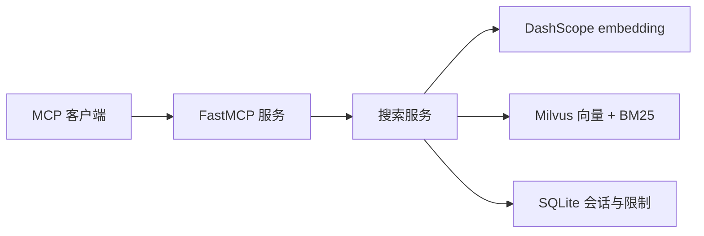

```mermaid
flowchart LR
    A[MCP 客户端] --> B[FastMCP 服务]
    B --> C[搜索服务]
    C --> D[DashScope embedding]
    C --> E[Milvus 向量 + BM25]
    C --> F[SQLite 会话与限制]
```

Milvus 保存 6,341 篇论文、向量、分析文本和筛选字段，并完成两路检索和 RRF 排名。SQLite 只保存运行状态，包括会话、请求计数、供应商分钟用量和 embedding 缓存。

Python 包分别组织传输、搜索、存储、索引、embedding、运行状态、领域模型和语料读取。新增数据源或调整检索时，不需要改动 MCP 传输层。
